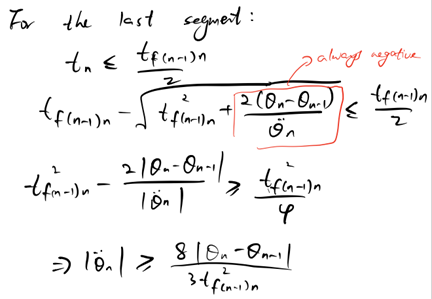

# Robot Arm Analysis of a 4 Degree-of-Freedom Manipulator

This is a 4 Degree of Freedom manipulator, with four joints labelled as red. Joint 1 is prismatic, joints 2, 3 and 4 are revolute.

The frame of reference chosen for each link, along with all parameters labelled:

It has four variables, $d_1$, $\theta_2$, $\theta_3$ and $\theta_4$, with ranges as below:
* $d_1: 5$ ~ $40$
* $\theta_2: -180^o$ ~ $180^o$
* $\theta_3: -90^o$ ~ $90^o$
* $\theta_4: -180^o$ ~ $180^o$

The constant values are:
* $l_0: 15$
* $l_2: 20$
* $l_3: 15$
* $l_4: 5$
* $l_e: 10$

These constrain the manipulator movement so that links would not overlap physically any other link or the table when moving.

# Forward Kinematics

[forward_kinematics.ipynb](forward_kinematics.ipynb)

DH Parameters:

This gives the transformation matrices:

The position of end effector in frame 0 is:

# Inverse Kinematics

[inverse_kinematics.ipynb](inverse_kinematics.ipynb)

The maths derivation is shown below:

# Jacobian

[Jacobian.ipynb](Jacobian.ipynb)

The linear and angular velocity of the joints can be obtained from the equations:

The velocity Jacobian was found to be:

# Trajectory Planning

[trajectory_planning.ipynb](trajectory_planning.ipynb)

Using linear functions with parabolic blends with via points.

## Kinematics Parameters

The parameters for the first, last and middle segments were found using the Equation below.

* For the first segment:

* For the last segment:

* For the middle segments (through via points):

## Minimum Acceleration

The first step is to find the minimum acceleration, so that the linear region can always be reached. Therefore the blend time for each segment has to be less than half of the time duration t_bc between two points (see Figure below). 

This is more complicated than the case without passing through the via points, as the trajectory is no longer symmetrical within each segment.

See derivation below:

* For the middle segments (through the via points):

Acceleration needs to satisfy both the conditions above.

* For the first segment:

* For the last segment:

## Calculate Kinematics Parameters

The next step is to calculate the acceleration, velocity, blend time and time for the linear regions.

## Plotting $\theta(t)$

In order to plot the trajectory, i.e., $\theta(t)$. The following equation can only be used for the trajectory without via points:

In this algorithm, the via points are not actually reached, the above equations cannot be used. The new equations are derived as below:

Note that $\theta_0$ and $\dot{\theta_0}$ are from the last point of the previous segment. For the first segment they are the initial position (Point A) and initial velocity (0). 

Check the function calc_parabolic_traj_via_points() in [tools.py](tools.py) for neater equations.
